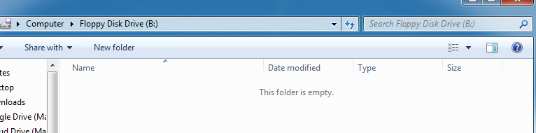

# Cài đặt Đĩa mềm ảo

## 1. Tổng quan

Bài tập này trình bày phương thức cài đặt và vận hành Đĩa mềm ảo (Virtual Floppy Disk - VFD), công cụ cung cấp môi trường đọc/ghi an toàn khi thực hành môn học.

## 2. Giới thiệu

Đĩa mềm là (Floppy Disk) một dạng của bộ nhớ máy tính, được sử dụng trong việc lưu trữ dữ liệu di động trước đây. Đĩa mềm có các kích thước và dung lượng thông dụng như sau:

Kích thước | Dung lượng
-----------|-----------
5 1⁄4" | 720 KB
5 1⁄4" | 1.2 MB
3 1/2" | 1.44 MB

Do dung lượng lưu trữ thấp và kích thước lớn, ngày nay, Đĩa mềm không còn được sử dụng nhiều để lưu trữ dữ liệu di động và được thay thế bởi  các phương thức lưu trữ mới như Bộ nhớ Flash, Ổ cứng di động, hay Điện toán đám mây...

Trong nội dung môn học này, ta sử dụng Đĩa mềm ảo, một dạng của bộ nhớ ảo, nhằm tạo ra môi trường đọc/ghi dữ liệu không ảnh hưởng đến tài nguyên lưu trữ chính của hệ thống.

## 3. Các bước thực hiện

### 3.1. Tải phần mềm

Tải về gói phần mềm tạo VFD tại địa chỉ sau: https://goo.gl/HgyVvv.

### 3.2. Cài đặt trình điều khiển

VFD yêu cầu một Trình Điều khiển (driver) để có thể truy cập như ổ đĩa vật lý, được cung cấp với tập tin *vfs.sys*. Tuy nhiên, driver này  chưa được chứng thực bởi nhà cung cấp, làm phát sinh vấn đề không cài đặt được trên Windows 7 và các Hệ Điều hành ra đời sau nó. Để giải quyết vấn đề này, ta cần thực hiện theo các bước sau:

**Bước 1:** Mở chưong trình **dseo13b.exe**.

**Bước 2:** Chọn *Enable Test Mode* và chọn *Next*.

**Bước 3:** Chọn *Exit* và chọn *Next*.

**Bước 4:** Khởi động lại Hệ Điều hành. Sau khi khởi động, Hệ Điều hành chuyển sang trạng thái *Test Mode*. Khi đó, ở góc phải bên dưới màn hình sẽ hiển thị thông tin như sau:

**Bước 5:** Mở chưong trình **dseo13b.exe**.

**Bước 6:** Chọn *Sign a System File* và chọn *Next*.

**Bước 7:** Một hộp thoại hiện lên yêu cầu nhập đường dẫn đầy đủ của tập tin *vfd.sys*. Trong gói cài đặt, các tập tin driver cho Hệ Điều hành x86 (32 bit) hay x64 (64 bit) chứa trong thư mục */sys*.

**Bước 8:** Chọn *Exit* và chọn *Next*.

**Bước 9:** Khởi động lại Hệ Điều hành. Sau khi khởi động lại, Hệ Điều hành có thể vận hành VFD với vai trò quản trị (Administrator).

### 3.3. Vận hành phần mềm Đĩa mềm ảo

#### 3.3.1. Khởi động trình điều khiển

**Bước 1:** Trong thư mục *bin* của gói cài đặt, khởi động chương trình *vfdwin.exe* với vai trò Quản trị.

**Bước 2:** Trong thẻ *Configuration*, chọn *Browse* và chọn tập tin *vfs.sys* tương ứng với nền tảng Hệ Điều hành hiện tại (x86 hoặc x64).

**Bước 3:** Chọn *Install*, sau đó chọn *Start* để khởi động trình điều khiển.

#### 3.3.2. Khởi động đĩa

**Bước 1:** Trong thẻ *Virtual Drive*, Chọn *Open/Create*.

**Bước 2:** Chọn *Browse* và chọn tập tin *empty.img* được cung cấp trong gói cài đặt.

**Bước 3:** Chọn *Change* để thiết lập tên đĩa. Chọn tên đĩa muốn sử dụng, và chọn *OK*.

Sau khi thực hiện bước 3, một ổ đĩa mới xuất hiện trên hệ thống như trong hình sau:

**Bước 4:** Khi bấm vào ổ đĩa vừa xuất hiện, một hộp thoại yêu cầu định dạng lại đĩa (Format). Ta tiến hành Format lại đĩa theo thông số mặt định. Sau khi format, ta có thể truy cập đĩa mới với định dạng FAT.

#### 3.3.2. Đóng và Lưu đĩa

**Bước 1:** Trong thẻ *Virtual Drive*, ta chọn *Close* để đóng đĩa.

**Bước 2:** Một hộp thoại xuất hiện xác nhận lưu đĩa hay không trước khi đóng. Trong trường hợp chọn *Yes*, màn hình lưu đĩa hiện lên như sau:

Điều chỉnh đường dẫn tập tin đĩa ở thông tin *Target File*. Sau đó chọn *Save* để lưu 
